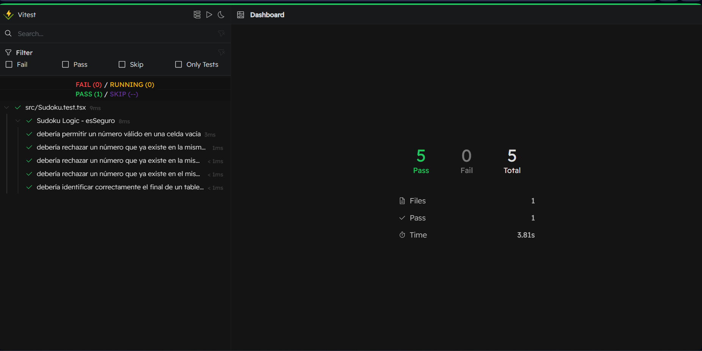

🧩 Sudoku - React & TypeScript
A sleek, high-performance, and fully responsive Sudoku game built with React, TypeScript, and Tailwind CSS. Designed with a focus on smooth user experience, realistic audio feedback, and robust logic validation.

✨ Features
Organic Logic Engine: Custom-built hooks for game state management, Sudoku generation, and real-time validation.

Fully Responsive: Adaptive design that scales perfectly from desktop monitors to mobile devices.

Immersive Audio: Distinct sound effects for board interactions, UI buttons, and victory celebrations, optimized for zero-latency.

Real-time Validation: Instant feedback on conflicting numbers (row, column, and 3x3 block validation).

Keyboard & Mouse Support: Seamless navigation using arrow keys or direct click/touch.

Clean Architecture: Separation of concerns between UI components and game logic.

🛠️ Tech Stack
Framework: React 18

Language: TypeScript

Styling: Tailwind CSS

Testing: Vitest + Vitest UI

State Management: React Hooks (useState, useEffect, useRef, useCallback)

🧪 Testing
This project uses Vitest for unit testing the core Sudoku engine. To ensure the game rules are never broken, we validate:

Safe number placement logic.

Row, column, and sub-grid conflict detection.

Full board solver accuracy.

To run tests with the visual UI:

Bash

npm run test:ui
🚀 Getting Started
Clone the repository

Install dependencies:
Bash:
npm install
Run the development server:

Bash:
npm run dev
Build for production:

Bash:
npm run build

📁 Project Structure
src/Sudoku.tsx: The "Brain" of the game. Contains the custom hook with all mathematical and audio logic.

src/App.tsx: Main entry point and UI layout.

src/Sudoku.test.tsx: Unit tests for the validation engine.

public/sound/: Audio assets for haptic-like feedback.

